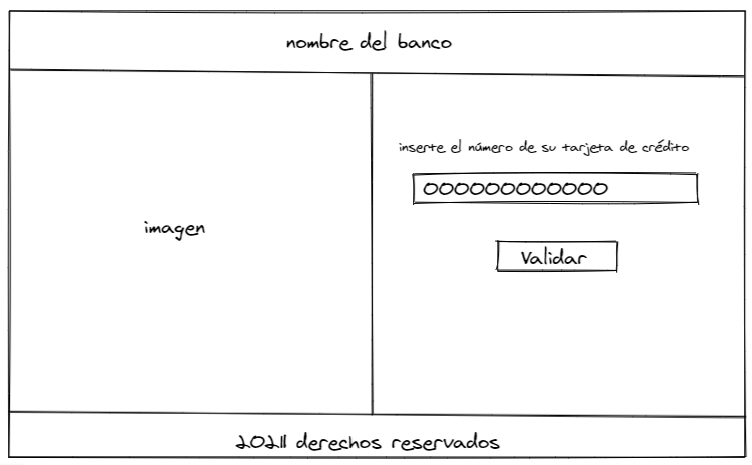
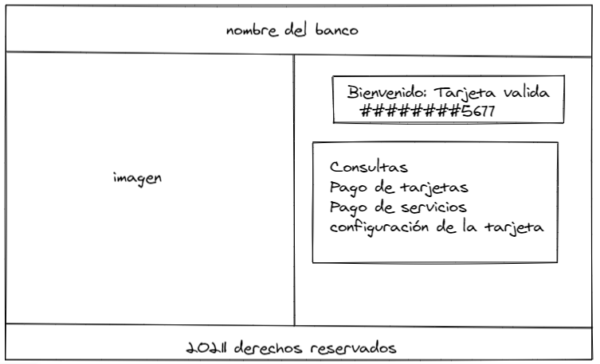
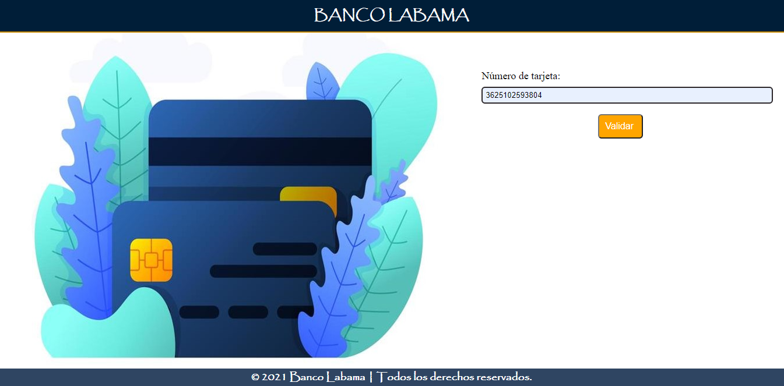
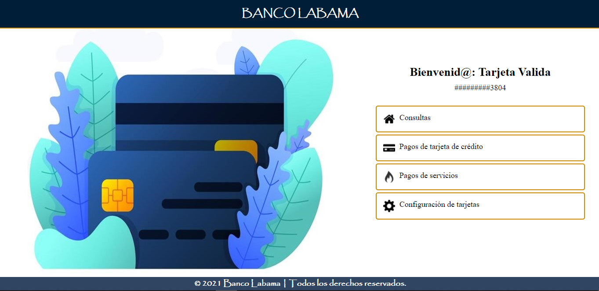

# Tarjeta de crédito válida

## Índice

* [1. Resumen del proyecto](#1-resumen-del-proyecto)
* [2. Usuarios](#2-Usuarios)
* [3. Soluciones que brinda la aplicación web.](#3-Soluciones-que-brinda-la-aplicación-web.)
* [4. Prototio de baja calidad](#4-Prototipo-de-baja-calidad)
* [5. Prototipo de alta calidad](#5-Prototipo-de-alta-calidad)

***

## 1. Resumen del proyecto

En este proyecto construiremos una aplicación web que le permite al usuario validar el número de su tarjeta de crédito para poder acceder a los diferentes servicios que le brinda el Banco Labama..

## 2. Usuarios 

Nuestros usuarios son clientes del Banco Labama que tienen la necesidad de contar con una aplicación web que les permita validar su tarjeta de crédito para poder acceder a la información y a los servicios que presta el Banco Labama.

## 3. Soluciones que brinda la aplicación web.

El usuario tiene la necesidad de validar su tarjeta de crédito del Banco Labama que es un requisito primordial para poder acceder a los servicios e información con respecto a sus movimientos financieros, la aplicación web le podrá informar si ingreso de forma correcta o no los números el cual  facilitara la verificación de la tarjeta de crédito mostrándole un mensaje donde podrá observar si es  válida o invalida.

## 4. Prototipo de baja calidad

  

  

## 5. Prototipo de alta calidad

  
  

### HTML y CSS

* [ ] Uso de HTML semántico.
* [ ] Uso de selectores de CSS.
* [ ] Construir tu aplicación respetando el diseño realizado (maquetación).

### DOM

* [ ] Uso de selectores del DOM.
* [ ] Manejo de eventos del DOM.
* [ ] Manipulación dinámica del DOM.(appendChild |createElement | createTextNode| innerHTML | textContent | etc.)

### JavaScript

* [ ] Manipulación de strings.
* [ ] Uso de condicionales (if-else | switch | operador ternario)
* [ ] Uso de bucles (for | for..in | for..of | while)
* [ ] Uso de funciones (parámetros | argumentos | valor de retorno)
* [ ] Declaración correcta de variables (const & let)

### Testing

* [ ] Testeo unitario.

### Estructura del código y guía de estilo

* [ ] Organizar y dividir el código en módulos (Modularización)
* [ ] Uso de identificadores descriptivos (Nomenclatura | Semántica)
* [ ] Uso de linter (ESLINT)

### Git y GitHub

* [ ] Uso de comandos de git (add | commit | pull | status | push)
* [ ] Manejo de repositorios de GitHub (clone | fork | gh-pages)

### UX

* [ ] Diseñar la aplicación pensando y entendiendo al usuario.
* [ ] Crear prototipos para obtener feedback e iterar.
* [ ] Aplicar los principios de diseño visual (contraste, alineación, jerarquía)

